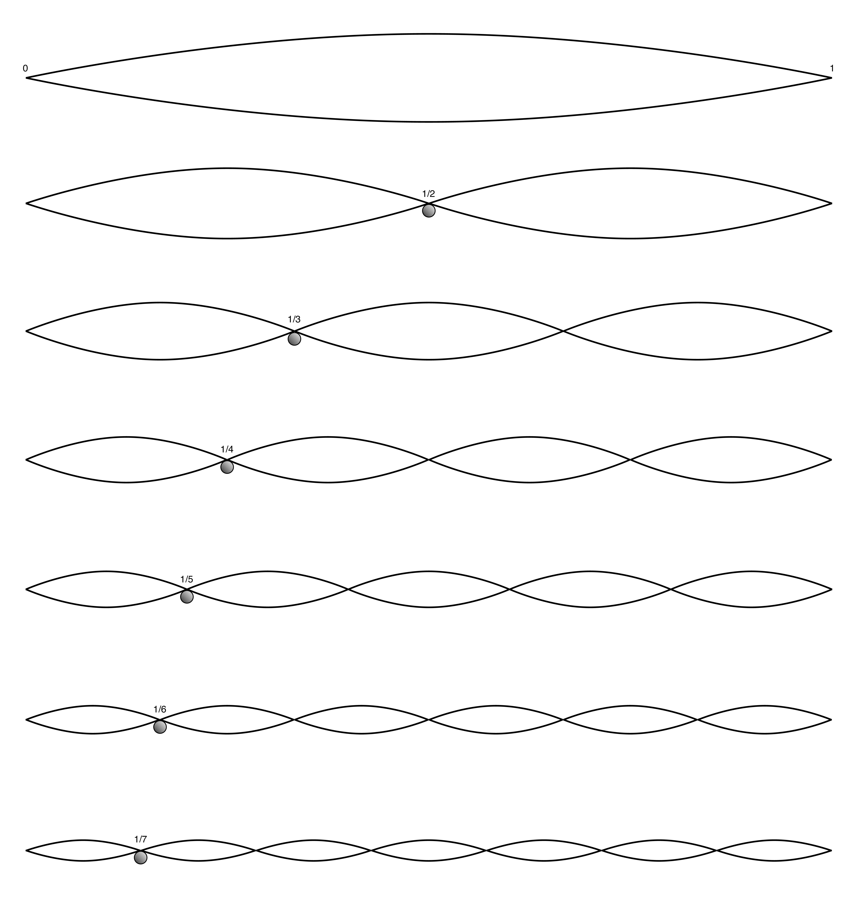

+++
title = "Spectral Balance and Equalization"
outputs = ["Reveal"]
[reveal_hugo]
theme = "moon"
margin = 0.2
separator = "##"
+++

## Fundamental Listening Skills

---

## Harmonic Series (Reference)

{}
- It can help memorization to relate the frequencies we’re listening for to pitches on the keyboard.
- These won’t match *exactly* because equal temperament (keyboard tuning) differs from the harmonic series.
- Goal for this unit: build reliable *frequency anchors* (even if the pitch mapping is approximate).
{}

---

## Harmonic Partials on a String

{}
- This shows how the harmonic series comes from a vibrating string dividing into halves, thirds, fourths, etc.
- Each smaller division creates a higher partial (higher frequency).
{}

---

## Piano Pitch vs Frequency Map

{}
- This chart maps piano pitches to frequencies (Hz) and rough frequency “regions”.
- Question to keep in mind: which piano pitches sit near our ISO octave anchors (63, 125, 250, 500, 1k, 2k, 4k, 8k, 16k)?
{}

---

| ISO Octaves | ET Frequency | Pitch |
| ----------- | ------------ | ----- |
| 63          | 61.7         | B1    |
| 125         | 123.5        | B2    |
| 250         | 246.9        | B3    |
| 500         | 493.9        | B4    |
| 1000        | 987.8        | B5    |
| 2000        | 1976         | B6    |
| 4000        | 3951         | B7    |
| 8000        | N/A          | B8    |
| 16000       | N/A          | B9    |

{}
Here's the ISO octaves and their equal tempered equivalents.
{}

---

## Ranges

---

## Spectral Balance

> **Spectral balance**: the distribution of energy across frequency bands from ~20 Hz to 20 kHz.

{}

**Show white noise vs pink noise in Reaper with ReaEQ.**

- Translating terms: “boomy / thin / muddy / boxy / harsh / bright / dull” are all *spectral balance* descriptions.
- We shape spectral balance most directly with EQ, but it’s influenced upstream (instrument, mic, placement, room) and downstream (monitors, room, level).
- Use analyzers as a *second opinion*: your job is to learn what the frequency regions sound like so you can act quickly without staring at a graph.

{}

---

## Tailoring Spectral Balance for Different Music Genres

- Different genres favor different balances (no single “correct” curve)
- Use references and style expectations
- Listen for masking (what disappears?) and buildup (what dominates?)
- Use analyzers to confirm, not to decide

{}

- Example: a jazz kit often wants more “air” and room, while a modern rock kit often wants more close-mic punch and controlled cymbal wash. Same instruments, different priorities.
- When you EQ, always ask:
  - What am I trying to hear more clearly?
  - What is currently masking it?
  - Am I fixing this with EQ, or is it better solved with mic choice/placement/level?
- Real-time analyzers are useful for learning, but music is dynamic—your ears integrate over time in a way a snapshot plot doesn’t.

{}

---

# Shaping Spectral Balance

---

## Equalization

{}

- Equalization, at a basic level, involves adjusting bass and treble, like with the tone controls on consumer sound systems. In recording, it's a more complex process.
- Besides equalizers, various tools and methods, both direct and indirect, are used to control the spectral balance of a recorded track.
- Equalizers are crucial for reducing certain frequencies that may mask others, as well as for enhancing specific frequency bands to bring out desired sound qualities.
- The use of equalization in recording and sound systems is both an art and a science. Engineers must have a keen ear to make precise adjustments in frequency, gain, and Q for optimal sound quality.

{}

---
## Microphone Choice and Placement

- [Charm Studio microphone list](https://docs.google.com/presentation/d/130uChoUPV370sMNJEc02n41QXdygYUO5zVqAWKoa900/present#slide=id.g10e552eff57_0_0) - see frequency response patterns.
- Compare [mic placement](https://cambridge-mt.com/rs2/lmp/) with a different instrument.
- Listen for proximity effect and off-axis coloration.

{}

- Different microphone types and models significantly influence the spectral balance of recorded sound, akin to filters in photography.
- Engineers choose microphones for their unique frequency responses, considering the specific sound source and recording environment.
- Microphone placement is crucial; its orientation and location relative to the sound source can dramatically alter the spectral balance. This includes the consideration of sound radiation patterns and the ratio of direct to reverberant sound.
- The proximity effect in directional microphones, especially evident in low frequencies, is another critical factor. Engineers must understand and skillfully use this phenomenon to enhance or control low-frequency response in recordings.

{}

---

## Indirect Factors Affecting Spectral Balance

{}

- Monitors and loudspeakers are critical in shaping how audio is perceived, as they translate electrical signals into acoustical energy. Their quality and characteristics can significantly affect the spectral balance.
- Room acoustics play a substantial role in sound quality. The size, shape, and materials of a studio room can alter the way sound waves propagate and are perceived, influencing the spectral balance.
- The perceived spectral balance can vary with different sound levels. Louder sounds can make certain frequencies more prominent, altering the perceived balance. Understanding this relationship is crucial for engineers to achieve a consistent spectral balance.

{}

---

## Role of Monitors and Loudspeakers in Audio Perception

- Your monitors have a “sound” (frequency response)
- Your room changes that sound (especially low end)
- Cross-check: headphones / second speakers / references
- Make decisions at consistent listening levels

{}

- “Flat” monitors don’t exist in practice—every playback system is a filter.
- If your monitors dip at 2 kHz, you’ll be tempted to over-boost 2 kHz in your mix.
- Best habits:
  - Use reference tracks you know well.
  - Check on headphones (removes most room influence).
  - Keep a consistent monitoring level for EQ decisions.

{}

---

## Control Room and Listening Room Acoustics

- Room modes reshape bass (peaks/nulls)
- Reflections reshape clarity and imaging
- Speaker + listener placement matters
- Translation checks beat “perfect rooms”

{}

- Low end is the biggest room problem: standing waves create big peaks and deep nulls depending on where you sit.
- Practical strategies:
  - Move your head: if the bass changes dramatically, you’re hearing the room.
  - Use reference tracks and multiple playback systems to check translation.
  - Consider basic treatment + thoughtful speaker/listener placement before overusing corrective EQ.
- Optional reading: ITU-R BS.1116 (critical listening environments) - [PDF](https://www.itu.int/dms_pubrec/itu-r/rec/bs/R-REC-BS.1116-3-201502-I!!PDF-E.pdf)

{}

---

## Sound Levels and Their Effect on Spectral Balance

- Your ears change with volume (equal-loudness contours)
- Do most EQ work at moderate/quiet levels
- Check briefly loud (impact) and very quiet (balance)
- Take breaks to avoid “ear drift”

{}

- Sound level significantly influences how we perceive the spectral balance of audio.
- The Fletcher-Munson equal-loudness contours demonstrate that human hearing sensitivity varies across frequencies and changes with sound level. This implies that the same audio can sound different at varying volumes.
- Mixing at high sound levels can lead to a skewed perception of low and high frequencies. Conversely, at lower levels, these frequencies might seem underrepresented.
- Audio engineers should monitor and adjust mixes at various sound levels to achieve a balance that remains consistent and pleasing across a range of listening conditions. This approach helps compensate for the varying sensitivity of the human ear to different frequencies at different volumes.

> Quick test: play a song very loud, then very soft. What changes first—bass, vocals, or cymbals?

{}

---

## Types of Filters and Equalizers

- Filters remove; EQ boosts/cuts
- Most common: high-pass, low-pass, shelving
- Surgical control: parametric EQ (freq + gain + Q)
- Visual + fixed bands: graphic EQ

{}

- Filters and equalizers, though related, serve distinct functions in shaping spectral balance. Filters typically remove frequencies, while equalizers adjust (boost or attenuate) them.
- Common filter types include high-pass (removing low frequencies), low-pass (removing high frequencies), and band-pass (allowing a specific range while removing others).
- Graphic equalizers provide a visual approach to adjusting frequencies, usually with fixed bands, allowing for broad control over the spectral balance.
- Parametric equalizers offer more precise control, enabling adjustments of specific frequency bands, levels of boost or cut, and bandwidth (Q factor), for detailed shaping of audio signals.

{}

---

## Filters: Low-Pass and High-Pass

- Cutoff frequency = “where it starts rolling off”
- Slope = “how steep the rolloff is” (dB/oct)

{}

- High-pass filters remove frequencies below a set cut-off point, commonly used to eliminate low-frequency noise or rumble in recordings. The key is setting the cut-off frequency appropriately to avoid losing important low-end content.
- Low-pass filters, conversely, cut out frequencies above a certain threshold, useful for reducing high-frequency noise or harshness in a sound.
- Some filters allow adjustment of the slope, determining how rapidly frequencies are attenuated beyond the cut-off point. This feature enables more control over how abruptly the filtered frequencies are reduced.

{}

---

## Graphic Equalizers

{}

- Graphic equalizers provide control over specific frequency bands, typically aligned with ISO standard octave frequencies like 31.5 Hz to 16,000 Hz.
- They often come with various frequency resolution options, such as 1/3rd octave or 1/12th octave bands, allowing more detailed control over the spectral balance.
- The bandwidth or Q of each band in a graphic equalizer is usually fixed, predetermined by the manufacturer, which sets the range of influence each adjustment has on the frequencies.
- The name "graphic equalizer" is derived from its interface, where vertical sliders create a visual representation of the equalization curve, mapping low to high frequencies from left to right. This visual aspect aids in understanding and adjusting the spectral balance.

{}

---

## Parametric Equalizers

- Three knobs: frequency, gain, Q (bandwidth)
- Low Q = wide changes; high Q = narrow changes
- Use wide for tone shaping; narrow for problems

{}

- Parametric equalizers, introduced by George Massenburg, offer finely tunable control over three key parameters: center frequency, Q (quality factor), and the level of boost or cut.
- Q factor relates to bandwidth: higher Q = narrower band. (Sometimes written as `Q = Fc / bandwidth`.)
- Despite the ideal of complete control, many parametric equalizers in practice have limitations. For example, Q may only be adjustable to preset values, and the center frequency selection might be restricted to specific choices.
- Some designs link Q to the amount of gain, where minimal adjustments yield broader bandwidths, and maximum adjustments result in narrower bandwidths. These constraints can impact the flexibility and precision with which an engineer can shape the audio's spectral balance.

{}

---

## Shelving Equalizers

{}

- Shelving equalizers are often mistaken for high-pass and low-pass filters, but they differ in function. While filters remove frequencies, shelving equalizers can either boost or attenuate them.
- A low-shelf equalizer affects frequencies below a certain point, and a high-shelf equalizer impacts frequencies above it, applying a uniform boost or cut across these ranges.
- In consumer audio, such as home or car sound systems, shelving equalizers are commonly used for basic tone control through 'bass' and 'treble' settings.
- In professional recording studios, shelving filters are frequently part of parametric equalizers, offering options for adjusting the extreme low and high ends of the frequency spectrum. They provide a versatile tool for fine-tuning the overall spectral balance of a recording.

{}

---

## Getting Started with Practice

[WebTET](https://webtet.net/apcl/#/about)

- Practice a little, often (10–15 minutes)
- Start with octave anchors (500 Hz–2 kHz)
- Keep gain/Q fixed at first; focus on recognition

{}

- Effective practice involves regular, focused sessions, ideally daily or several times a week. Shorter sessions (10-15 minutes initially, gradually increasing up to 45-60 minutes) are recommended to avoid fatigue and maximize learning efficiency. Even brief daily practices can be more beneficial than infrequent, prolonged sessions.
- The software provides randomly generated equalization settings within user-defined limitations, offering a practical and interactive way to sharpen listening and technical skills in equalization.

{}

---

## Practice Types in WebTET

- Match (with reference)
- Match (memory)
- Return to flat (undo EQ)
- Absolute ID (name the settings)

{}

- **Matching Mode**: The objective is to replicate the equalization applied by the software, allowing comparison between the original and user's adjustments.
- **Matching Memory Mode**: Similar to Matching, but with the added challenge of relying on memory, as the original setting becomes unavailable after any adjustments are made.
- **Return to Flat Mode**: This mode involves reversing the software's equalization to bring the audio back to its original spectral balance, requiring opposite adjustments to the applied changes.
- **Absolute Identification Mode**: The most challenging mode, where the goal is to identify the equalization settings applied by the software without any reference. This mode tests and improves the user's ability to discern subtle audio changes.

{}

---

## Frequency Resolution

- Start with 1 octave (9 anchors)
- Add neighbors (1/3 octave) once anchors feel solid
- Strategy: find the nearest octave, then refine
- Example region: 800–1k–1.25k–1.6k–2k–2.5k

{}

- "WebTET" offers two frequency resolution options: 1 octave and 1/3rd octave.
- **1 Octave**: Easier, with 9 possible frequencies. Ideal for beginners to familiarize with basic frequency recognition.
- **1/3rd Octave**: More challenging, encompassing 25 frequencies, including all octave frequencies plus additional frequencies between each octave pair.
- A key strategy for mastering third-octave frequencies is to initially anchor to the nearest octave frequency. Once familiar with the nine octave frequencies, users can then progress to identifying the more nuanced third-octave frequencies.
- Example: around 1 kHz and 2 kHz, the third-octave “neighbors” are 800, 1000, 1250, 1600, 2000, and 2500 Hz. Listen for which anchor you’re closest to, then decide if it’s the lower or upper neighbor.

{}

---

## ISO Octave Frequencies (Cheat Sheet)

---

## Managing Frequency Range

- Start narrow (e.g., 500 Hz–2 kHz)
- Expand outward one octave at a time
- Low end is hardest (room + playback limits)
- Headphones help, but have their own “curve”

{}

- In "WebTET", users can limit the frequency range for practice, starting from a full range of 63 Hz to 16,000 Hz down to as narrow as three octaves.
- Beginners are advised to start with a limited midrange, such as 500 to 2000 Hz, mastering these frequencies before expanding the range.
- As proficiency improves, users can gradually include more octaves, eventually working up to the full frequency range.
- Identifying low frequencies (63 Hz to 250 Hz) can be particularly challenging due to factors like inconsistent levels in music recordings, limitations of sound reproduction systems, and room acoustics. Using headphones can mitigate issues caused by room acoustics, though their frequency response should be considered. For the best results, especially in low frequencies, selecting high-quality headphones with a flat response is crucial.

{}

---

## Working with the EQ Practice Module

- Pink noise: learn the anchors
- Music: notice what changes (kick, snare, vocals, cymbals)
- Compare quickly: bypass vs EQ
- Keep notes: what does 500/1k/2k “feel like”?

{}

- Upon opening the EQ practice module, select pink noise and adjust the volume. Explore each octave frequency to understand its sound. Remember, the gain jumps to 12dB by default for each new frequency.
- When loading a sound file, notice how different frequencies affect various instruments. For example, 125 Hz might enhance a snare drum, while 8kHz could highlight cymbal harmonics.
- Each recording reacts differently to the same frequency adjustments, emphasizing the need for a unique approach to each mix. What works for one recording may not suit another.

{}

---

## Vowel Method (Octave Anchors)

- 250 Hz = [u] as in boot
- 500 Hz = [o] as in tow
- 1000 Hz = [a] as in father
- 2000 Hz = [e] as in bet
- 4000 Hz = [i] as in beet

{}

- Researchers have found that associating vowel sounds with octave frequencies aids in identifying them due to formant frequencies. This technique is rooted in studies by Letowski, Miskiewicz, Opolko, Woszczyk, Quesnel, and Slawson.
- Key vowel sounds and their corresponding frequencies: 250 Hz is like [u] in "boot," 500 Hz as [o] in "tow," 1000 Hz like [a] in "father," 2000 Hz as [e] in "bet," and 4000 Hz resembles [i] in "beet."
- By associating a sound with a vowel, learners can more easily remember and identify specific frequencies. This method is beneficial for auditory memory and frequency recognition.

{}

---

## Recommended recordings

- Anderson, Arild. (2004). “Straight” from The Triangle. ECM Records. (jazz piano trio)
- Blanchard, Terence. (2001). “On the Sunny Side of the Street” from Let’s Get Lost. Sony. (jazz with vocals)
- Earth, Wind & Fire. (1998). “September” from Greatest Hits. Sony. (R&B pop)
- Hellendaal, Pieter. (1991). “Concerto II—Presto” from 6 Concerti Grossi. Perf. The European Community Baroque Orchestra. Channel Classics. (Baroque orchestra)

{}

- Pick one recording to become your “home base” reference for a few weeks so your ears learn what “normal” sounds like.
- When practicing, focus on one question at a time:
  - “What gets louder when I boost 500 Hz?”
  - “What disappears when I cut 2 kHz?”
- If you switch recordings every day, it’s harder to build stable anchors because the instrumentation and mix balance change.

{}

---

- Le Concert des Nations. (2002). "Marche pour la cérémonie" from Soundtrack from the film Tous les matins du monde. Alia Vox Spain. (Baroque orchestra)
- Randall, Jon. (2005). Walking Among the Living. Epic/Sony BMG Music Entertainment. (roots music/bluegrass)
- Steely Dan. (2000). "Gaslighting Abbie" from Two Against Nature. Giant Records. (pop)
- The Police. (1983). "Every Breath You Take" from Synchronicity. A&M Records. (rock)
